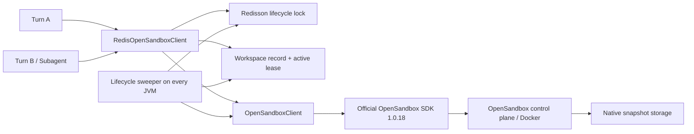
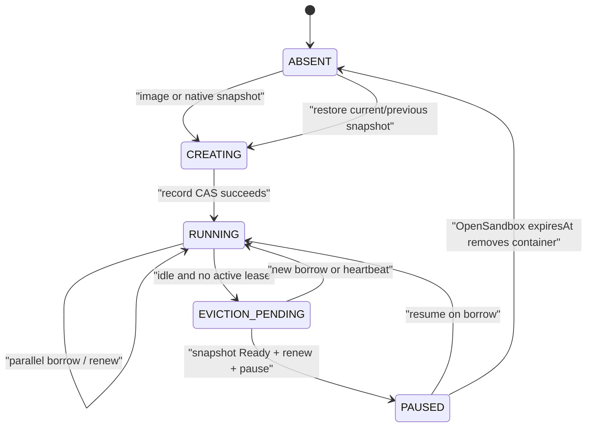

# OpenSandbox Redis Cluster Integration Implementation Plan

> **For agentic workers:** REQUIRED SUB-SKILL: Use superpowers:subagent-driven-development (recommended) or superpowers:executing-plans to implement this plan task-by-task. Steps use checkbox (`- [ ]`) syntax for tracking.

**Goal:** 基于官方 OpenSandbox Java SDK 和 Redisson，为 AgentScope Java 增加可在多 JVM 实例间安全复用、暂停、恢复和原生快照回建的 OpenSandbox workspace 生命周期管理。

**Architecture:** 保留现有 `agentscope-extensions-sandbox-opensandbox` 作为单沙箱 SDK 适配层，只扩展其现有类以暴露官方 SDK 已有的 metadata、info、pause/resume、renew 和 native snapshot 能力。仅新增 `agentscope-extensions-sandbox-opensandbox-redis` 模块，由它负责 workspace 身份、Redisson 生命周期锁、活动 Turn 租约、空闲扫描和故障协调；Turn 执行阶段不持有 Redis 锁，多个 Turn/Subagent 可连接同一个 workspace 并行执行。

**Tech Stack:** Java 17、Maven、AgentScope Harness Sandbox SPI、OpenSandbox Java SDK 1.0.18、Redisson 4.2.0、Jackson、JUnit 6、Mockito。

---

## 1. 设计结论

### 1.1 必须保持的边界

1. 只新增一个 Maven 模块：

   ```text
   agentscope-extensions-sandbox-opensandbox-redis
   ```

2. `agentscope-harness` 和现有 `agentscope-extensions-sandbox-opensandbox` 只能修改已有类，不能在这些模块新增 Java 类。
3. OpenSandbox 官方 SDK 负责远端 create/connect/info/list/metadata/pause/resume/renew/kill/native snapshot 和文件传输，不在 AgentScope 中重新实现 HTTP 协议。
4. Redisson 只协调 workspace 生命周期，不使用 `SandboxExecutionGuard` 串行整个 Turn。
5. 默认 workspace 身份是 `userId + agentId`；`USER` 缺少 userId 时沿用 Harness 现有逻辑回退到 `sessionId + agentId`。
6. 一个 workspace 可同时存在多个活动 Turn/Subagent 租约，每个调用持有独立 SDK handle。
7. 不处理 MCP；MCP 连接方式、代理和工具注册均不属于本计划。
8. Redis 只保存状态和 native snapshot ID，不保存 OpenSandbox API key，也不保存完整 workspace 文件。
9. Redis 模式默认使用 OpenSandbox native snapshot；现有 tar snapshot 仅保留给基础适配器兼容，不作为集群模式的默认持久化路径。

### 1.2 官方 SDK 1.0.18 已有能力

规划直接委托以下已核实 API：

```java
SandboxManager.getSandboxInfo(sandboxId);
SandboxManager.listSandboxInfos(SandboxFilter.builder().metadata(metadata).build());
SandboxManager.patchSandboxMetadata(sandboxId, metadata);
SandboxManager.pauseSandbox(sandboxId);
SandboxManager.resumeSandbox(sandboxId);
SandboxManager.renewSandbox(sandboxId, duration);
SandboxManager.killSandbox(sandboxId);
SandboxManager.createSnapshot(sandboxId, name);
SandboxManager.waitForSnapshotReady(snapshotId, timeout);
SandboxManager.getSnapshot(snapshotId);
SandboxManager.listSnapshots(snapshotFilter);
SandboxManager.deleteSnapshot(snapshotId);

Sandbox.builder()
        .snapshotId(snapshotId)
        .metadata(metadata)
        .timeout(duration)
        .build();
```

因此不实现下列重复功能：

- 不自己拼 OpenSandbox REST 请求。
- 不把 `/workspace` tar 下载到 JVM 后再上传 OSS/COS，作为 Redis 模式的默认快照方案。
- 不自己模拟 pause/resume。
- 不由 AgentScope 定时执行暂停后的 kill；默认 5 分钟后由 OpenSandbox `expiresAt` 最终回收远端容器。
- 不在 Redis 中存 snapshot 二进制内容。

## 2. 总体架构



职责分配：

| 组件 | 负责 | 不负责 |
|---|---|---|
| Harness `SandboxManager` | 解析 isolation key，把 key 和 agentId 传给 client | OpenSandbox 集群状态机 |
| 基础 `OpenSandboxClient` | 官方 SDK 的薄封装、状态序列化、单沙箱操作 | Redis、定时扫描、分布式锁 |
| `RedisOpenSandboxClient` | borrow/release、workspace generation、活动租约 | 命令级互斥 |
| `OpenSandboxWorkspaceStore` | Redis key、CAS、RLock、RMapCache、idle index | 远端 OpenSandbox 操作 |
| `OpenSandboxLifecycleSweeper` | renew、snapshot、pause、孤儿协调 | Turn 内命令执行 |
| OpenSandbox 服务端 | 容器、pause/resume、expiresAt、native snapshot | AgentScope user/agent workspace 身份 |

## 3. 文件边界

### 3.1 修改现有文件，不新增类

**Harness 上下文透传**

- Modify: `agentscope-harness/src/main/java/io/agentscope/harness/agent/sandbox/SandboxClient.java`
- Modify: `agentscope-harness/src/main/java/io/agentscope/harness/agent/sandbox/SandboxManager.java`
- Test: `agentscope-harness/src/test/java/io/agentscope/harness/agent/sandbox/SandboxManagerIsolationTest.java`

**基础 OpenSandbox SDK 适配**

- Modify: `agentscope-extensions/agentscope-extensions-sandbox/agentscope-extensions-sandbox-opensandbox/src/main/java/io/agentscope/extensions/sandbox/opensandbox/OpenSandboxSdk.java`
- Modify: `agentscope-extensions/agentscope-extensions-sandbox/agentscope-extensions-sandbox-opensandbox/src/main/java/io/agentscope/extensions/sandbox/opensandbox/OfficialOpenSandboxSdk.java`
- Modify: `agentscope-extensions/agentscope-extensions-sandbox/agentscope-extensions-sandbox-opensandbox/src/main/java/io/agentscope/extensions/sandbox/opensandbox/OpenSandboxClient.java`
- Modify: `agentscope-extensions/agentscope-extensions-sandbox/agentscope-extensions-sandbox-opensandbox/src/main/java/io/agentscope/extensions/sandbox/opensandbox/OpenSandboxClientOptions.java`
- Modify: `agentscope-extensions/agentscope-extensions-sandbox/agentscope-extensions-sandbox-opensandbox/src/main/java/io/agentscope/extensions/sandbox/opensandbox/OpenSandboxState.java`
- Modify: `agentscope-extensions/agentscope-extensions-sandbox/agentscope-extensions-sandbox-opensandbox/src/main/java/io/agentscope/extensions/sandbox/opensandbox/OpenSandbox.java`
- Test: `agentscope-extensions/agentscope-extensions-sandbox/agentscope-extensions-sandbox-opensandbox/src/test/java/io/agentscope/extensions/sandbox/opensandbox/OpenSandboxClientOptionsTest.java`
- Test: `agentscope-extensions/agentscope-extensions-sandbox/agentscope-extensions-sandbox-opensandbox/src/test/java/io/agentscope/extensions/sandbox/opensandbox/OpenSandboxClientTest.java`
- Test: `agentscope-extensions/agentscope-extensions-sandbox/agentscope-extensions-sandbox-opensandbox/src/test/java/io/agentscope/extensions/sandbox/opensandbox/OpenSandboxStateSerializationTest.java`
- Test: `agentscope-extensions/agentscope-extensions-sandbox/agentscope-extensions-sandbox-opensandbox/src/test/java/io/agentscope/extensions/sandbox/opensandbox/OpenSandboxTest.java`

**Reactor、发布和文档**

- Modify: `agentscope-extensions/agentscope-extensions-sandbox/pom.xml`
- Modify: `agentscope-distribution/agentscope-bom/pom.xml`
- Modify: `agentscope-distribution/agentscope-all/pom.xml`
- Modify: `docs/v2/zh/docs/harness/sandbox.md`
- Modify: `docs/v2/en/docs/harness/sandbox.md`
- Modify: `docs/v2/zh/integration/overview.md`
- Modify: `docs/v2/en/integration/overview.md`

### 3.2 只在新模块新增的文件

```text
agentscope-extensions/agentscope-extensions-sandbox/
  agentscope-extensions-sandbox-opensandbox-redis/
    pom.xml
    src/main/java/io/agentscope/extensions/sandbox/opensandbox/redis/
      RedisOpenSandboxClient.java
      RedisManagedOpenSandbox.java
      RedisOpenSandboxFilesystemSpec.java
      OpenSandboxRedisLifecycleOptions.java
      OpenSandboxWorkspaceRecord.java
      OpenSandboxActiveLease.java
      OpenSandboxWorkspaceStore.java
      OpenSandboxLifecycleSweeper.java
    src/test/java/io/agentscope/extensions/sandbox/opensandbox/redis/
      RedisOpenSandboxClientTest.java
      RedisManagedOpenSandboxTest.java
      RedisOpenSandboxFilesystemSpecTest.java
      OpenSandboxRedisLifecycleOptionsTest.java
      OpenSandboxWorkspaceStoreTest.java
      OpenSandboxLifecycleSweeperTest.java
      OpenSandboxRedisConcurrencyIntegrationTest.java
      OpenSandboxRedisRealServiceIntegrationTest.java
```

不新增 Spring starter、MCP 类、通用 `sandbox-pool-redis` 模块或新的 Harness SPI 类型。

## 4. Harness 接口调整

在 `SandboxClient` 增加向后兼容的默认重载：

```java
default Sandbox create(
        WorkspaceSpec workspaceSpec,
        SandboxSnapshotSpec snapshotSpec,
        O options,
        SandboxIsolationKey isolationKey,
        String agentId) {
    return create(workspaceSpec, snapshotSpec, options);
}

default Sandbox resume(
        SandboxState state,
        SandboxIsolationKey isolationKey,
        String agentId) {
    return resume(state);
}
```

`SandboxManager.acquire()` 在 Priority 3 和 Priority 4 调用上述重载，并传入 `scopeKey.orElse(null)` 与已有 `agentId`。旧 provider 无需修改；Redis client 收到 null key 时 fail closed，防止在集群中创建无法归属和恢复的沙箱。

以下路径保持原样：

- 用户注入 `externalSandbox`：调用者自行管理。
- 用户注入 `externalSandboxState`：按基础 client 的显式 state 语义处理，不进入 Redis workspace 池。
- `SandboxExecutionGuard` 默认仍是 no-op；使用 Redis OpenSandbox 时文档明确不得再配置覆盖整个 Turn 的 Redis execution guard。

## 5. Workspace 身份

按 isolation scope 生成 canonical identity，再使用 SHA-256 Base64URL 无填充编码作为 `workspaceId`，避免把 userId/sessionId 明文写入 Redis key 或 OpenSandbox metadata：

```text
USER    -> v1\0user\0{agentId}\0{userId}
SESSION -> v1\0session\0{agentId}\0{sessionId}
AGENT   -> v1\0agent\0{agentId}
GLOBAL  -> v1\0global
```

默认 `IsolationScope.USER`，因此正常路径即 `userId + agentId`。同一 user 的两个不同 agent 不共享 workspace；同一 user、同一 agent 的多个 session/Turn/Subagent 共享 workspace。

## 6. Redis 数据模型

### 6.1 Key schema

```text
agentscope:opensandbox:{workspaceId}:lifecycle-lock
agentscope:opensandbox:{workspaceId}:record
agentscope:opensandbox:{workspaceId}:active-turns
agentscope:opensandbox:idle:v1
agentscope:opensandbox:orphan-sandboxes:v1
agentscope:opensandbox:orphan-snapshots:v1
```

前三个 key 的 `{workspaceId}` 是 Redis Cluster hash tag，确保 workspace 内的锁、record 和 lease 位于同一 slot。全局 idle/orphan index 是提示性索引，不与 workspace record 做跨 slot 事务；每次扫描必须重新加载 record 并在 lifecycle lock 下验证，错误索引可安全删除或重建。

数据结构：

- lifecycle lock：`RLock`，使用 `tryLock(waitTime, TimeUnit)` 和 Redisson watchdog，不设置可能在 snapshot 等待期间提前过期的固定 leaseTime。
- record：`RBucket<String>`，JSON 编码；关键切换使用 `compareAndSet(oldJson, newJson)`。
- active turns：`RMapCache<String, String>`，field 为 `leaseId`，每个 entry 独立 TTL。
- idle/orphan index：`RScoredSortedSet<String>`，score 为下次处理的 epoch millis。

### 6.2 Workspace record

`OpenSandboxWorkspaceRecord` 至少包含：

```java
public final class OpenSandboxWorkspaceRecord {
    public enum LifecycleState { CREATING, RUNNING, EVICTION_PENDING, PAUSED, ABSENT, ERROR }

    private int schemaVersion;
    private String workspaceId;
    private String isolationScope;
    private String agentId;
    private String sandboxId;
    private String serializedSandboxState;
    private LifecycleState lifecycleState;
    private long generation;
    private String nativeSnapshotId;
    private String previousNativeSnapshotId;
    private Instant lastAccessAt;
    private Instant pausedAt;
    private Instant expiresAt;
    private Instant evictionCandidateAt;
    private boolean dirty;
    private String lastError;
    private Instant updatedAt;
}
```

约束：

- `generation` 只在创建新的远端 sandbox 时递增；pause/resume 不递增。
- `serializedSandboxState` 不包含 API key，只保存 OpenSandbox ID、workspace readiness/projection hash、image/options 和 metadata。
- record 不保存原始 userId/sessionId。
- `nativeSnapshotId` 是当前可恢复版本；`previousNativeSnapshotId` 是回滚版本。
- `dirty=true` 表示当前 sandbox 自上次成功 native snapshot 后可能被修改；borrow 时保守设为 true。

### 6.3 Active lease

`OpenSandboxActiveLease` 包含：

```java
public record OpenSandboxActiveLease(
        String leaseId,
        String workspaceId,
        long generation,
        String ownerInstanceId,
        Instant startedAt,
        Instant heartbeatAt) {}
```

每个 Turn/Subagent 使用不同 `leaseId`。默认每 30 秒刷新一次，entry TTL 为 180 秒；heartbeat 使用 put/upsert，即使 Redis 短暂故障导致 entry 过期，恢复后也会重新登记。

### 6.4 OpenSandbox metadata

创建 sandbox 时写入：

```text
agentscope.owner=opensandbox-redis
agentscope.workspace-id={workspaceId}
agentscope.generation={generation}
agentscope.schema-version=1
```

metadata 只使用哈希后的 workspaceId。创建完成但 Redis 写入失败时，后续实例可通过 `SandboxFilter.metadata(...)` 找回远端孤儿。

## 7. 生命周期状态机



### 7.1 Borrow / create / resume

```text
resolve workspaceId
-> try lifecycle RLock
-> load record and prune expired lease entries
-> record missing: discover by OpenSandbox metadata
-> sandboxId present: getSandboxInfo and reconcile real status
-> RUNNING: renew only when expiresAt enters active-renew window
-> PAUSED: official SDK resumeSandbox
-> 404/ABSENT: create from current nativeSnapshotId
-> current snapshot restore fails: try previousNativeSnapshotId
-> snapshots exist but both fail: fail closed, never create an empty workspace
-> no snapshot exists: create from configured image
-> write/update record with generation and metadata
-> add this Turn's active lease before unlock
-> remove workspace from idle index
-> unlock
-> return RedisManagedOpenSandbox
```

远端 create 成功而 Redis record 写入失败时，当前调用返回失败，不继续执行 Turn。远端 sandbox 保留 metadata，下一次在锁内 reconciliation；禁止在 Redis 不可用时“先创建再说”。

### 7.2 Turn 执行

```text
RedisManagedOpenSandbox.start()
-> OpenSandbox.start() 连接独立 SDK handle
-> 启动本 lease heartbeat
-> Turn/Subagent 并行 exec/read/write
```

执行期间不持有 lifecycle RLock，也不持有 `SandboxExecutionGuard`。OpenSandbox 官方服务处理同一个 sandbox 的多连接和多命令；共享文件的写写冲突由调用方语义负责，本模块不虚构文件事务。

### 7.3 Release

```text
cancel heartbeat
-> OpenSandbox.disconnect() 只关闭本地 SDK handle
-> try lifecycle RLock
-> 删除本 leaseId（generation 不匹配时只删自己的 lease）
-> 合并可序列化 sandbox state、lastAccessAt、dirty=true
-> active leases 为空：idle index score = now + idleTtl
-> active leases 非空：不加入 idle index
-> unlock
```

`RedisManagedOpenSandbox.stop()` 必须在 finally 中释放 lease；`shutdown()` 对普通 Turn release 是幂等 no-op。显式 `RedisOpenSandboxClient.delete(sandbox)` 才执行受锁保护的 kill、snapshot 清理和 Redis record 删除。

### 7.4 Heartbeat 与长 Turn

- heartbeat 只刷新本 Turn 的 `RMapCache` entry 和 idle index，不获取生命周期锁。
- sweeper 每 5 分钟检查有活动 lease 的 workspace；当 `expiresAt` 进入 6 分钟窗口时，在 lifecycle lock 下 renew 到 10 分钟。
- Redis 短暂故障时 Turn 可继续使用已经建立的 SDK handle；Redis 故障期间 sweeper 同样无法取得锁。
- Redis 恢复后，首次发现“无 lease 且已 idle”的 workspace 只进入 `EVICTION_PENDING`，等待 5 分钟 eviction grace。恢复中的 heartbeat 或新 borrow 会取消 eviction，避免恢复瞬间误 pause 长 Turn。

### 7.5 Idle sweeper

每个 JVM 可启动 sweeper，不选 leader；多个实例会扫描同一提示性 idle index，但每个 workspace 的 `tryLock` 保证远端生命周期操作只有一个执行者。

默认流程：

```text
poll due workspaceId
-> tryLock(0)
-> reload record, prune expired leases, validate index
-> active leases 非空：取消 eviction，必要时 renew，重新排期
-> 第一次确认 idle：写 EVICTION_PENDING + evictionCandidateAt，延后 5 分钟
-> grace 后仍无 lease：先 renew，保证 snapshot 窗口不会到期
-> dirty=true 或没有 current snapshot：createSnapshot
-> waitForSnapshotReady(snapshotId, snapshotReadyTimeout)
-> CAS 切换 current/previous snapshot ID，dirty=false
-> renew sandbox 到 pauseRetention=5min
-> pause sandbox
-> CAS 状态为 PAUSED，并记录 expiresAt/pausedAt
-> 新 snapshot 已提交后，删除“旧 previous”版本
```

若 `dirty=false` 且已有 current snapshot，可直接 renew + pause，不重复创建 snapshot。

### 7.6 Native snapshot 提交顺序

native snapshot 与 Redis 无法形成跨系统 ACID 事务，使用幂等 saga：

1. 持有 workspace lifecycle lock。
2. 确认 active lease 为空且 generation/sandboxId 未变化。
3. 先 renew，避免 snapshot 过程中 sandbox 自然过期。
4. 调用 `createSnapshot`，再 `waitForSnapshotReady`。
5. 只有 Ready 后才 CAS 更新 Redis record：

   ```text
   previousNativeSnapshotId = old nativeSnapshotId
   nativeSnapshotId = new snapshotId
   dirty = false
   ```

6. CAS 失败时不删除旧 current snapshot；把新 snapshot 加入 orphan snapshot index，稍后确认无人引用再删除。
7. record 提交成功后 renew + pause。
8. pause 成功后更新 PAUSED 状态；若 Redis 更新失败，下次通过 `getSandboxInfo` 校正实际状态。
9. 最后只删除 record 不再引用的“旧 previous”snapshot，始终保留 current + previous 两个版本。

snapshot name 使用可检索且不含用户明文的格式：

```text
agentscope-ws-{workspaceId}-g{generation}-{epochMillis}
```

正常恢复直接使用 Redis 中的 snapshot ID，不扫描服务端。只有 Redis record 丢失且原 sandbox 已不存在时，才通过官方 `listSnapshots` 分页读取 Ready snapshot，按 workspace name 前缀筛选，并按 `createdAt` 倒序选择 current 和 previous。这只是重建索引，不会把 snapshot 内容下载到 JVM。

snapshot create/wait 失败时：

```text
不 pause
不 kill
不切换 snapshot ID
renew 当前 sandbox
记录 lastError
下一个 5 分钟 sweep 周期重试
```

### 7.7 暂停 5 分钟后的回收

AgentScope 在 pause 前调用 `renewSandbox(sandboxId, Duration.ofMinutes(5))`。之后由 OpenSandbox `expiresAt` 终止远端 sandbox；AgentScope 不再实现第二套定时 kill。5 分钟内再次 borrow 可直接 resume，超过 5 分钟则从 native snapshot 创建新 sandbox。

该默认值参考现有实现：

| 实现 | 默认时间 |
|---|---:|
| AgentScope Python OpenSandbox | sandbox keep-alive 300 秒 |
| AgentScope Python E2B / Daytona | sandbox timeout 300 秒 |
| AgentScope Java E2B | `sandboxTimeoutSeconds=300` |
| Hermes terminal environment | inactive lifetime 300 秒 |
| AgentScope Java OpenSandbox 基础适配器 | `sandboxTimeoutSeconds=600` |
| AgentScope Java DataAgent registry | idle 15 分钟、每 60 秒扫描 |

因此集群模式采用“活动时续期到 10 分钟、空闲 60 分钟后 snapshot/pause、暂停容器再保留 5 分钟”。native snapshot 已经 Ready 后才 pause，所以缩短容器保留时间不会删除 workspace 数据，只会把后续启动路径从 resume 变成 snapshot restore。若 OpenSandbox 服务端限制最小 timeout 大于 5 分钟，则使用服务端允许的最小值，并把返回的实际 `expiresAt` 写回 record。

下一次 borrow 发现 sandbox 404 时：

1. 从 `nativeSnapshotId` 创建新 sandbox。
2. current snapshot 不可用时尝试 `previousNativeSnapshotId`。
3. 两个 snapshot 都不可用则报错，不从 image 创建空 workspace。
4. 新 sandbox generation +1，metadata 和 record 一并更新。

native snapshot 默认长期保留，直到显式 `delete`；这是 workspace 持久化数据，不随暂停容器的 5 分钟 TTL 删除。

## 8. Metadata 孤儿协调

在 lifecycle lock 内、record 缺失或 record.sandboxId 404 时：

1. 用 `agentscope.owner + agentscope.workspace-id` 查询远端 sandbox。
2. 过滤非 RUNNING/PAUSED 或 unhealthy 实例。
3. 选择 `generation` 最大、再按 `createdAt` 最新的实例作为 winner。
4. 为 winner 重建 Redis record，并把 generation 保持为远端 metadata 值。
5. loser 不立即 kill：patch metadata 标记 `agentscope.orphaned-at`，放入 orphan index，给予默认 10 分钟 grace。
6. orphan sweeper 在 grace 后重新检查：没有 record 指向该 sandbox、没有同 generation active lease、远端仍存在，才 kill。

该策略处理“create 已成功、Redis 写失败”和“JVM 在 create 后崩溃”。若 Redis 整体数据丢失，grace 给仍在运行的旧 Turn 时间重新 heartbeat：远端 sandbox 仍存在时用 metadata 重建 record；sandbox 已过期时用 deterministic snapshot name + 官方 `listSnapshots` 找回最新两个 Ready snapshot，再重建 record。无法在 Redis 数据永久丢失时同时保证零泄漏和永不误杀，默认优先数据安全，延迟清理。

## 9. 基础 OpenSandbox 类调整

### 9.1 `OpenSandboxSdk` / `OfficialOpenSandboxSdk`

在现有 package-private interface 增加官方 SDK 委托方法，返回 AgentScope 已有 `OpenSandboxState` 或 JDK 类型，不在基础模块新增 DTO 类：

```java
OpenSandboxState getInfo(String sandboxId, OpenSandboxClientOptions options) throws Exception;
List<OpenSandboxState> listByMetadata(
        Map<String, String> metadata, OpenSandboxClientOptions options) throws Exception;
void patchMetadata(String sandboxId, Map<String, String> metadata,
        OpenSandboxClientOptions options) throws Exception;
Instant renew(String sandboxId, Duration duration, OpenSandboxClientOptions options)
        throws Exception;
void pause(String sandboxId, OpenSandboxClientOptions options) throws Exception;
void resumeRemote(String sandboxId, OpenSandboxClientOptions options) throws Exception;
String createSnapshot(String sandboxId, String name, Duration readyTimeout,
        OpenSandboxClientOptions options) throws Exception;
Map<String, Instant> listReadySnapshotsByNamePrefix(
        String namePrefix, OpenSandboxClientOptions options) throws Exception;
void deleteSnapshot(String snapshotId, OpenSandboxClientOptions options) throws Exception;
```

`OfficialOpenSandboxSdk` 只做 model 映射、try-with-resources 和 404 分类；不增加缓存和重试循环。

### 9.2 `OpenSandboxState`

在现有类增加：

```java
private String restoreSnapshotId;
private Map<String, String> metadata = Map.of();
private String remoteStatus;
private Instant remoteCreatedAt;
private Instant remoteExpiresAt;
```

`restoreSnapshotId` 只表示“下次 create 从哪个 OpenSandbox native snapshot 启动”，不是 AgentScope `SandboxSnapshot` tar 对象。

### 9.3 `OpenSandboxClientOptions`

在现有类增加并纳入 `copyOf/merge`：

```java
private String restoreSnapshotId;
private Map<String, String> metadata = Map.of();
```

API key 继续只存在于 live client options，不进入 `OpenSandboxState` 和 Redis JSON。

### 9.4 `OpenSandbox`

增加 public、幂等的：

```java
public void disconnect() throws Exception {
    closeHandle();
}
```

现有 `stop()` 的 tar snapshot 兼容行为保持不变；Redis wrapper 调用 `disconnect()`，不调用基础 `stop()`。

404 重建规则：

- 没有 `restoreSnapshotId`：清空 `workspaceRootReady` 和 `workspaceProjectionHash`，从 image 创建后重新投影。
- 有 `restoreSnapshotId`：从 native snapshot 创建，保留 workspace ready/projection 语义；当前 WorkspaceSpec hash 不同仍会重新投影。

`OfficialOpenSandboxSdk.create()` 将 `restoreSnapshotId`、metadata 和 timeout 透传给 `Sandbox.Builder`。

## 10. 默认配置

`OpenSandboxRedisLifecycleOptions` 默认值：

| 配置 | 默认值 | 说明 |
|---|---:|---|
| `idleTtl` | 60 min | 无活动 Turn 后进入 snapshot/pause，与 Python OpenSandbox 一致 |
| `sweepInterval` | 5 min | 每个 JVM 的扫描周期，与 Python OpenSandbox 一致 |
| `evictionGrace` | 5 min | Redis 恢复或 lease 抖动时的二次确认 |
| `activeLeaseTtl` | 180 sec | Turn heartbeat entry TTL |
| `heartbeatInterval` | 30 sec | 每个 Turn 的 lease 续期 |
| `activeSandboxTtl` | 10 min | RUNNING sandbox 的远端续期目标，与当前基础 OpenSandbox 默认一致 |
| `activeRenewLead` | 6 min | 大于 5 分钟 sweepInterval，确保不会错过 10 分钟 active TTL 的续期窗口 |
| `pauseRetention` | 5 min | PAUSED sandbox 短暂保留供快速 resume，之后由服务端回收 |
| `snapshotReadyTimeout` | 5 min | 官方 SDK waitForSnapshotReady 超时；snapshot 前先 renew 到 activeSandboxTtl |
| `lockWait` | 10 sec | borrow/release 等待生命周期锁 |
| `orphanGrace` | 10 min | 重复远端实例延迟清理 |
| `sweeperEnabled` | true | 每个实例启动 daemon sweeper |

校验关系：

```text
heartbeatInterval * 3 <= activeLeaseTtl
sweepInterval < idleTtl
activeRenewLead < activeSandboxTtl
snapshotReadyTimeout < activeSandboxTtl
evictionGrace >= heartbeatInterval
```

`RedisOpenSandboxClient.close()` 只关闭自己创建的 heartbeat/sweeper scheduler，不 shutdown 外部注入的 `RedissonClient` 或基础 `OpenSandboxClient`。

## 11. 故障矩阵

| 故障 | 行为 | 数据安全 |
|---|---|---|
| Redis 在 borrow 前不可用 | fail closed，不 create/resume | 不会重复创建 |
| lifecycle lock 超时 | 抛可重试 busy/configuration exception | 不修改远端 |
| create 成功、record 写失败 | 调用失败，依靠 metadata 找回 | 不 kill 新 sandbox |
| record 存在、远端 404 | current snapshot 恢复，再尝试 previous | 不直接创建空 workspace |
| OpenSandbox control plane 暂时不可达 | borrow/sweeper 失败并重试 | record 和旧 snapshot 不变 |
| snapshot create 失败 | renew、保持 RUNNING、下轮重试 | 不 pause/kill |
| snapshot wait 超时/FAILED | 不切换 snapshot ID | 旧 current 继续有效 |
| snapshot Ready 后 record CAS 失败 | 新 snapshot 进入 orphan index | 不删除旧 current |
| pause 成功、Redis 更新失败 | 下轮 `getSandboxInfo` 校正 PAUSED | snapshot 已提交 |
| renew 失败 | 不 pause；记录错误并尽快重试 | 避免进入未知过期窗口 |
| heartbeat JVM 崩溃 | lease TTL 到期，eviction grace 后回收 | 最多延迟 idleTtl + grace |
| Redis 短暂中断后恢复 | heartbeat upsert；sweeper 二次确认 | 降低误 pause 长 Turn 风险 |
| 两个 JVM 同时 borrow | RLock 串行生命周期，均登记独立 lease | Turn 执行仍并行 |
| 锁 watchdog 丢失 | 写 record 前检查持锁并 CAS generation | 失败对象由 metadata 协调 |
| current snapshot restore 失败 | 尝试 previous；仍失败则 fail closed | 不覆盖为新空 workspace |
| 删除旧 snapshot 失败 | 记录 orphan，稍后重试 | 只产生临时存储泄漏 |
| detached 后台进程无 Turn lease | idle 后会 pause | 初版不把远端进程探测当活动 lease |

最后一项是明确限制：初版 active lease 代表 AgentScope Turn/Subagent，不自动枚举任意 detached shell process。需要长期后台执行时，应保持对应后台任务的 AgentScope lease，或调大 `idleTtl`；不在本计划中手写 OpenSandbox 进程管理器。

## 12. 实施任务

### Task 1: 接入新 Maven 模块

**Files:**
- Modify: `agentscope-extensions/agentscope-extensions-sandbox/pom.xml`
- Create: `agentscope-extensions/agentscope-extensions-sandbox/agentscope-extensions-sandbox-opensandbox-redis/pom.xml`
- Modify: `agentscope-distribution/agentscope-bom/pom.xml`
- Modify: `agentscope-distribution/agentscope-all/pom.xml`

- [ ] **Step 1: 先验证模块尚不存在**

Run:

```powershell
mvn -pl agentscope-extensions/agentscope-extensions-sandbox/agentscope-extensions-sandbox-opensandbox-redis help:evaluate -Dexpression=project.artifactId -q -DforceStdout
```

Expected: Maven 报 selected project 不存在。

- [ ] **Step 2: 创建模块 POM 并接入 reactor/BOM/all**

新模块依赖保持为：

```xml
<dependencies>
    <dependency>
        <groupId>io.agentscope</groupId>
        <artifactId>agentscope-harness</artifactId>
        <scope>provided</scope>
    </dependency>
    <dependency>
        <groupId>io.agentscope</groupId>
        <artifactId>agentscope-extensions-sandbox-opensandbox</artifactId>
    </dependency>
    <dependency>
        <groupId>org.redisson</groupId>
        <artifactId>redisson</artifactId>
    </dependency>
</dependencies>
```

不依赖 `agentscope-extensions-redis`，避免把 Jedis/Lettuce 和通用 state store 一并引入；Redisson 版本已由 dependencies BOM 管理。

- [ ] **Step 3: 验证 dependency tree**

Run:

```powershell
mvn -pl agentscope-extensions/agentscope-extensions-sandbox/agentscope-extensions-sandbox-opensandbox-redis -am dependency:tree -Dincludes=com.alibaba.opensandbox:sandbox,org.redisson:redisson -DskipTests
```

Expected: 包含 `com.alibaba.opensandbox:sandbox:1.0.18` 和 `org.redisson:redisson:4.2.0`。

- [ ] **Step 4: 提交**

```powershell
git add agentscope-extensions/agentscope-extensions-sandbox/pom.xml agentscope-extensions/agentscope-extensions-sandbox/agentscope-extensions-sandbox-opensandbox-redis/pom.xml agentscope-distribution/agentscope-bom/pom.xml agentscope-distribution/agentscope-all/pom.xml
git commit -m "build: add OpenSandbox Redis lifecycle module"
```

### Task 2: 向 SandboxClient 透传 workspace identity

**Files:**
- Modify: `agentscope-harness/src/main/java/io/agentscope/harness/agent/sandbox/SandboxClient.java`
- Modify: `agentscope-harness/src/main/java/io/agentscope/harness/agent/sandbox/SandboxManager.java`
- Test: `agentscope-harness/src/test/java/io/agentscope/harness/agent/sandbox/SandboxManagerIsolationTest.java`

- [ ] **Step 1: 写失败测试**

增加 recording client，覆盖 state hit 和 state miss：

```java
@Test
void contextAwareClientReceivesResolvedUserKeyAndAgentIdOnCreate() throws Exception {
    RuntimeContext context = RuntimeContext.builder()
            .userId("user-1").sessionId("session-1").build();

    manager.acquire(
            SandboxContext.builder().isolationScope(IsolationScope.USER).build(), context);

    assertEquals(IsolationScope.USER, client.createKey.getScope());
    assertEquals("user-1", client.createKey.getValue());
    assertEquals(AGENT_ID, client.createAgentId);
}
```

再测试 persisted state 命中走 context-aware `resume`，以及 userId/sessionId 都缺失时传 null key。

- [ ] **Step 2: 运行并确认失败**

```powershell
mvn -pl agentscope-harness -Dtest=SandboxManagerIsolationTest -Dsurefire.failIfNoSpecifiedTests=false test
```

Expected: FAIL，context-aware overload 尚不存在或未被调用。

- [ ] **Step 3: 增加默认重载并修改 SandboxManager**

使用第 4 节的两个 default method；Priority 3 调用：

```java
Sandbox sandbox = client.resume(state, scopeKey.orElse(null), agentId);
```

Priority 4 调用：

```java
Sandbox sandbox = typedClient.create(
        spec,
        sandboxContext.getSnapshotSpec(),
        sandboxContext.getClientOptions(),
        scopeKey.orElse(null),
        agentId);
```

- [ ] **Step 4: 验证旧 client 兼容和新测试通过**

```powershell
mvn -pl agentscope-harness -Dtest=SandboxManagerIsolationTest,SandboxClientRemoteSnapshotRebindTest -Dsurefire.failIfNoSpecifiedTests=false test
```

Expected: PASS。

- [ ] **Step 5: 提交**

```powershell
git add agentscope-harness/src/main/java/io/agentscope/harness/agent/sandbox/SandboxClient.java agentscope-harness/src/main/java/io/agentscope/harness/agent/sandbox/SandboxManager.java agentscope-harness/src/test/java/io/agentscope/harness/agent/sandbox/SandboxManagerIsolationTest.java
git commit -m "feat(harness): pass sandbox isolation identity to clients"
```

### Task 3: 扩展基础 OpenSandbox 官方 SDK 委托

**Files:**
- Modify: `agentscope-extensions/agentscope-extensions-sandbox/agentscope-extensions-sandbox-opensandbox/src/main/java/io/agentscope/extensions/sandbox/opensandbox/OpenSandboxSdk.java`
- Modify: `agentscope-extensions/agentscope-extensions-sandbox/agentscope-extensions-sandbox-opensandbox/src/main/java/io/agentscope/extensions/sandbox/opensandbox/OfficialOpenSandboxSdk.java`
- Modify: `agentscope-extensions/agentscope-extensions-sandbox/agentscope-extensions-sandbox-opensandbox/src/main/java/io/agentscope/extensions/sandbox/opensandbox/OpenSandboxClient.java`
- Test: `agentscope-extensions/agentscope-extensions-sandbox/agentscope-extensions-sandbox-opensandbox/src/test/java/io/agentscope/extensions/sandbox/opensandbox/OpenSandboxClientTest.java`

- [ ] **Step 1: 写 recording SDK 的失败测试**

测试 `OpenSandboxClient` 的 public 管理方法逐一委托且使用 default options：

```java
@Test
void managementOperationsDelegateToOfficialSdkBoundary() throws Exception {
    client.pause("sandbox-1");
    client.resumeRemote("sandbox-1");
    client.renew("sandbox-1", Duration.ofMinutes(30));
    String snapshotId = client.createNativeSnapshot(
            "sandbox-1", "workspace-v1", Duration.ofMinutes(10));

    assertEquals(List.of("sandbox-1"), sdk.pausedIds);
    assertEquals(List.of("sandbox-1"), sdk.resumedIds);
    assertEquals("snapshot-1", snapshotId);
}
```

另测 `describe`、`listByMetadata`、分页 `listReadyNativeSnapshotsByNamePrefix`、`patchMetadata`、`deleteNativeSnapshot` 和 404 分类。snapshot list 返回值只包含 Ready 状态，并保留 createdAt 供灾难恢复排序。

- [ ] **Step 2: 运行并确认失败**

```powershell
mvn -pl agentscope-extensions/agentscope-extensions-sandbox/agentscope-extensions-sandbox-opensandbox -am -Dtest=OpenSandboxClientTest -Dsurefire.failIfNoSpecifiedTests=false test
```

Expected: FAIL，管理方法尚不存在。

- [ ] **Step 3: 扩展已有 interface 和官方实现**

按第 9.1 节签名扩展 `OpenSandboxSdk`；`OfficialOpenSandboxSdk` 使用 `SandboxManager` 的官方方法。`getInfo/listByMetadata` 映射到已有 `OpenSandboxState`，`createSnapshot` 必须在方法内完成 create + wait Ready 后才返回 ID。

- [ ] **Step 4: 在 OpenSandboxClient 暴露 public 薄封装**

```java
public OpenSandboxState describe(String sandboxId);
public List<OpenSandboxState> listByMetadata(Map<String, String> metadata);
public void patchMetadata(String sandboxId, Map<String, String> metadata);
public Instant renew(String sandboxId, Duration duration);
public void pause(String sandboxId);
public void resumeRemote(String sandboxId);
public String createNativeSnapshot(String sandboxId, String name, Duration readyTimeout);
public Map<String, Instant> listReadyNativeSnapshotsByNamePrefix(String namePrefix);
public void deleteNativeSnapshot(String snapshotId);
public boolean isNotFound(Throwable error);
```

所有方法统一把 checked exception 包装成现有 `SandboxException`，但保留 cause 供 `isNotFound` 遍历。

- [ ] **Step 5: 运行基础模块全部单测**

```powershell
mvn -pl agentscope-extensions/agentscope-extensions-sandbox/agentscope-extensions-sandbox-opensandbox -am test
```

Expected: PASS；真实服务 test 因环境变量缺失而 skip。

- [ ] **Step 6: 提交**

```powershell
git add agentscope-extensions/agentscope-extensions-sandbox/agentscope-extensions-sandbox-opensandbox
git commit -m "feat(opensandbox): expose native lifecycle operations"
```

### Task 4: 增加 metadata、native restore 和 disconnect 语义

**Files:**
- Modify: `agentscope-extensions/agentscope-extensions-sandbox/agentscope-extensions-sandbox-opensandbox/src/main/java/io/agentscope/extensions/sandbox/opensandbox/OpenSandboxClientOptions.java`
- Modify: `agentscope-extensions/agentscope-extensions-sandbox/agentscope-extensions-sandbox-opensandbox/src/main/java/io/agentscope/extensions/sandbox/opensandbox/OpenSandboxState.java`
- Modify: `agentscope-extensions/agentscope-extensions-sandbox/agentscope-extensions-sandbox-opensandbox/src/main/java/io/agentscope/extensions/sandbox/opensandbox/OfficialOpenSandboxSdk.java`
- Modify: `agentscope-extensions/agentscope-extensions-sandbox/agentscope-extensions-sandbox-opensandbox/src/main/java/io/agentscope/extensions/sandbox/opensandbox/OpenSandboxClient.java`
- Modify: `agentscope-extensions/agentscope-extensions-sandbox/agentscope-extensions-sandbox-opensandbox/src/main/java/io/agentscope/extensions/sandbox/opensandbox/OpenSandbox.java`
- Test: `agentscope-extensions/agentscope-extensions-sandbox/agentscope-extensions-sandbox-opensandbox/src/test/java/io/agentscope/extensions/sandbox/opensandbox/OpenSandboxClientOptionsTest.java`
- Test: `agentscope-extensions/agentscope-extensions-sandbox/agentscope-extensions-sandbox-opensandbox/src/test/java/io/agentscope/extensions/sandbox/opensandbox/OpenSandboxStateSerializationTest.java`
- Test: `agentscope-extensions/agentscope-extensions-sandbox/agentscope-extensions-sandbox-opensandbox/src/test/java/io/agentscope/extensions/sandbox/opensandbox/OpenSandboxTest.java`

- [ ] **Step 1: 写失败测试**

覆盖：

```java
@Test
void disconnectClosesHandleWithoutKillingOrPersistingTar() throws Exception {
    Fixture fixture = fixture();
    fixture.sandbox.start();

    fixture.sandbox.disconnect();

    assertEquals(1, fixture.sdk.handle.closeCalls);
    assertTrue(fixture.sdk.killedIds.isEmpty());
    assertTrue(fixture.sdk.handle.commands.stream().noneMatch(c -> c.contains("tar -cf")));
}

@Test
void createPassesMetadataAndNativeSnapshotToSdk() throws Exception {
    Fixture fixture = fixture();
    fixture.state.setRestoreSnapshotId("snapshot-1");
    fixture.state.setMetadata(Map.of("agentscope.workspace-id", "workspace-1"));

    fixture.sandbox.start();

    assertEquals("snapshot-1", fixture.sdk.createdState.getRestoreSnapshotId());
    assertEquals("workspace-1",
            fixture.sdk.createdState.getMetadata().get("agentscope.workspace-id"));
}

@Test
void imageRecreateClearsProjectionHashButSnapshotRecreatePreservesIt() throws Exception {
    Fixture image = fixture();
    image.state.setSandboxId("gone-image");
    image.state.setWorkspaceProjectionHash("old-hash");
    image.sdk.connectFailure = new NotFoundException();
    image.sandbox.start();
    assertNull(image.state.getWorkspaceProjectionHash());

    Fixture snapshot = fixture();
    snapshot.state.setSandboxId("gone-snapshot");
    snapshot.state.setRestoreSnapshotId("snapshot-1");
    snapshot.state.setWorkspaceProjectionHash("snapshot-hash");
    snapshot.sdk.connectFailure = new NotFoundException();
    snapshot.sandbox.start();
    assertEquals("snapshot-hash", snapshot.state.getWorkspaceProjectionHash());
}

@Test
void serializedStateNeverContainsApiKey() {
    OpenSandboxClientOptions options = new OpenSandboxClientOptions();
    options.setApiKey("secret-only-for-test");
    OpenSandboxClient client = new OpenSandboxClient(options, null);
    Sandbox sandbox = client.create(new WorkspaceSpec(), null, null);

    assertFalse(client.serializeState(sandbox.getState()).contains("secret-only-for-test"));
}
```

- [ ] **Step 2: 运行并确认失败**

```powershell
mvn -pl agentscope-extensions/agentscope-extensions-sandbox/agentscope-extensions-sandbox-opensandbox -am -Dtest=OpenSandboxTest,OpenSandboxClientOptionsTest,OpenSandboxStateSerializationTest -Dsurefire.failIfNoSpecifiedTests=false test
```

- [ ] **Step 3: 实现现有类字段、copy/merge 和 builder 透传**

使用第 9 节字段；reserved `agentscope.*` metadata 由 Redis client 最终覆盖。`OfficialOpenSandboxSdk.create` 仅在 restore ID 非空时调用 `.snapshotId(...)`。

- [ ] **Step 4: 实现幂等 disconnect 和两类 404 重建规则**

`disconnect()` 只调用现有 `closeHandle()`。基础 `stop()/shutdown()` 原语义不变，保证非 Redis 用户不回归。

- [ ] **Step 5: 运行基础 OpenSandbox 单测**

```powershell
mvn -pl agentscope-extensions/agentscope-extensions-sandbox/agentscope-extensions-sandbox-opensandbox -am test
```

Expected: PASS。

- [ ] **Step 6: 提交**

```powershell
git add agentscope-extensions/agentscope-extensions-sandbox/agentscope-extensions-sandbox-opensandbox
git commit -m "feat(opensandbox): support native snapshot restoration"
```

### Task 5: 实现 Redis 配置、record 和 workspace identity

**Files:**
- Create: `agentscope-extensions/agentscope-extensions-sandbox/agentscope-extensions-sandbox-opensandbox-redis/src/main/java/io/agentscope/extensions/sandbox/opensandbox/redis/OpenSandboxRedisLifecycleOptions.java`
- Create: `agentscope-extensions/agentscope-extensions-sandbox/agentscope-extensions-sandbox-opensandbox-redis/src/main/java/io/agentscope/extensions/sandbox/opensandbox/redis/OpenSandboxWorkspaceRecord.java`
- Create: `agentscope-extensions/agentscope-extensions-sandbox/agentscope-extensions-sandbox-opensandbox-redis/src/main/java/io/agentscope/extensions/sandbox/opensandbox/redis/OpenSandboxActiveLease.java`
- Test: `agentscope-extensions/agentscope-extensions-sandbox/agentscope-extensions-sandbox-opensandbox-redis/src/test/java/io/agentscope/extensions/sandbox/opensandbox/redis/OpenSandboxRedisLifecycleOptionsTest.java`

- [ ] **Step 1: 写默认值和非法组合测试**

```java
@Test
void defaultsMatchClusterLifecycleContract() {
    OpenSandboxRedisLifecycleOptions options = new OpenSandboxRedisLifecycleOptions();
    assertEquals(Duration.ofHours(1), options.getIdleTtl());
    assertEquals(Duration.ofMinutes(5), options.getSweepInterval());
    assertEquals(Duration.ofMinutes(5), options.getEvictionGrace());
    assertEquals(Duration.ofSeconds(30), options.getHeartbeatInterval());
    assertEquals(Duration.ofSeconds(180), options.getActiveLeaseTtl());
    assertEquals(Duration.ofMinutes(6), options.getActiveRenewLead());
    assertEquals(Duration.ofMinutes(5), options.getPauseRetention());
}

@Test
void rejectsLeaseTtlShorterThanThreeHeartbeats() {
    assertThrows(IllegalArgumentException.class, () ->
            options.setActiveLeaseTtl(Duration.ofSeconds(60)));
}
```

再测试同一 user+agent 稳定得到相同 workspaceId，不同 agent 不同，workspaceId 不含原 userId。

- [ ] **Step 2: 运行并确认失败**

```powershell
mvn -pl agentscope-extensions/agentscope-extensions-sandbox/agentscope-extensions-sandbox-opensandbox-redis -am -Dtest=OpenSandboxRedisLifecycleOptionsTest -Dsurefire.failIfNoSpecifiedTests=false test
```

- [ ] **Step 3: 实现不可变 copy、校验和 JSON record**

workspace hash helper 保持为 `RedisOpenSandboxClient` 的 package-private static method，不为它另建基础模块类。所有时间使用 `Instant`，所有 Duration 必须 positive。

- [ ] **Step 4: 运行测试并提交**

```powershell
mvn -pl agentscope-extensions/agentscope-extensions-sandbox/agentscope-extensions-sandbox-opensandbox-redis -am -Dtest=OpenSandboxRedisLifecycleOptionsTest -Dsurefire.failIfNoSpecifiedTests=false test
git add agentscope-extensions/agentscope-extensions-sandbox/agentscope-extensions-sandbox-opensandbox-redis
git commit -m "feat(opensandbox-redis): define workspace lifecycle state"
```

### Task 6: 实现 Redisson workspace store

**Files:**
- Create: `agentscope-extensions/agentscope-extensions-sandbox/agentscope-extensions-sandbox-opensandbox-redis/src/main/java/io/agentscope/extensions/sandbox/opensandbox/redis/OpenSandboxWorkspaceStore.java`
- Test: `agentscope-extensions/agentscope-extensions-sandbox/agentscope-extensions-sandbox-opensandbox-redis/src/test/java/io/agentscope/extensions/sandbox/opensandbox/redis/OpenSandboxWorkspaceStoreTest.java`

- [ ] **Step 1: 写 store contract 测试**

Mockito 测试必须验证精确 key 和结构：

```java
assertEquals(
        "agentscope:opensandbox:{" + workspaceId + "}:record",
        store.recordKey(workspaceId));
assertEquals(
        "agentscope:opensandbox:{" + workspaceId + "}:active-turns",
        store.activeTurnsKey(workspaceId));
```

另测 record CAS、lease entry TTL、expired lease 不计 active、idle index 仅作提示，以及 store 不调用 `redisson.shutdown()`。

- [ ] **Step 2: 运行并确认失败**

```powershell
mvn -pl agentscope-extensions/agentscope-extensions-sandbox/agentscope-extensions-sandbox-opensandbox-redis -am -Dtest=OpenSandboxWorkspaceStoreTest -Dsurefire.failIfNoSpecifiedTests=false test
```

- [ ] **Step 3: 实现 StringCodec + ObjectMapper store**

关键 API：

```java
RLock lifecycleLock(String workspaceId);
Optional<OpenSandboxWorkspaceRecord> load(String workspaceId);
boolean compareAndSet(OpenSandboxWorkspaceRecord expected,
        OpenSandboxWorkspaceRecord update);
void putLease(OpenSandboxActiveLease lease, Duration ttl);
void removeLease(String workspaceId, String leaseId);
List<OpenSandboxActiveLease> activeLeases(String workspaceId, long generation);
void scheduleIdle(String workspaceId, Instant dueAt);
void cancelIdle(String workspaceId);
List<String> dueIdle(Instant now, int limit);
```

JSON 使用显式 `ObjectMapper.findAndRegisterModules()`，不使用 Redisson Java object serialization，避免类版本升级后无法读取。

- [ ] **Step 4: 运行测试并提交**

```powershell
mvn -pl agentscope-extensions/agentscope-extensions-sandbox/agentscope-extensions-sandbox-opensandbox-redis -am -Dtest=OpenSandboxWorkspaceStoreTest -Dsurefire.failIfNoSpecifiedTests=false test
git add agentscope-extensions/agentscope-extensions-sandbox/agentscope-extensions-sandbox-opensandbox-redis
git commit -m "feat(opensandbox-redis): add Redisson workspace store"
```

### Task 7: 实现并行 borrow、heartbeat 和 release

**Files:**
- Create: `agentscope-extensions/agentscope-extensions-sandbox/agentscope-extensions-sandbox-opensandbox-redis/src/main/java/io/agentscope/extensions/sandbox/opensandbox/redis/RedisOpenSandboxClient.java`
- Create: `agentscope-extensions/agentscope-extensions-sandbox/agentscope-extensions-sandbox-opensandbox-redis/src/main/java/io/agentscope/extensions/sandbox/opensandbox/redis/RedisManagedOpenSandbox.java`
- Test: `agentscope-extensions/agentscope-extensions-sandbox/agentscope-extensions-sandbox-opensandbox-redis/src/test/java/io/agentscope/extensions/sandbox/opensandbox/redis/RedisOpenSandboxClientTest.java`
- Test: `agentscope-extensions/agentscope-extensions-sandbox/agentscope-extensions-sandbox-opensandbox-redis/src/test/java/io/agentscope/extensions/sandbox/opensandbox/redis/RedisManagedOpenSandboxTest.java`

- [ ] **Step 1: 写 create/resume 并发语义失败测试**

覆盖：

- 两个相同 workspace 的 create/resume 只创建一个远端 sandbox，但返回两个不同 leaseId。
- 第一个 Turn 未 release 时，第二个 Turn 仍能 acquire；没有调用 `SandboxExecutionGuard`。
- PAUSED 只调用一次 official resume。
- Redis 不可用/锁超时不调用远端 create。
- 记录有 current snapshot 时 restore 失败先试 previous，不回退 image。
- start 后 heartbeat upsert，stop finally 删除自己的 lease。
- `shutdown()` 不 kill；显式 `delete()` 才 kill。

核心并行断言：

```java
assertNotEquals(first.leaseId(), second.leaseId());
assertEquals(2, store.activeLeases(workspaceId, generation).size());
verify(delegate, times(1)).create(any(), isNull(), any());
verify(delegate, never()).pause(anyString());
```

- [ ] **Step 2: 运行并确认失败**

```powershell
mvn -pl agentscope-extensions/agentscope-extensions-sandbox/agentscope-extensions-sandbox-opensandbox-redis -am -Dtest=RedisOpenSandboxClientTest,RedisManagedOpenSandboxTest -Dsurefire.failIfNoSpecifiedTests=false test
```

- [ ] **Step 3: 实现 context-aware create/resume 共用 borrow**

```java
@Override
public Sandbox create(
        WorkspaceSpec spec,
        SandboxSnapshotSpec ignoredTarSnapshot,
        OpenSandboxClientOptions options,
        SandboxIsolationKey key,
        String agentId) {
    return borrow(spec, options, requireWorkspaceId(key, agentId));
}
```

Redis 模式若传入 persistence-enabled tar `SandboxSnapshotSpec`，立即抛 configuration exception，提示改用基础 OpenSandbox client；不静默同时执行两套 snapshot。

- [ ] **Step 4: 实现 wrapper 生命周期**

`RedisManagedOpenSandbox` 实现 `Sandbox` 和 `SandboxFileTransfer`，delegates `start/exec/persistWorkspace/hydrateWorkspace/upload/download`。`stop()` 的 finally 顺序必须是 cancel heartbeat、disconnect、release lease；重复调用不重复删除或更新。

- [ ] **Step 5: 运行测试并提交**

```powershell
mvn -pl agentscope-extensions/agentscope-extensions-sandbox/agentscope-extensions-sandbox-opensandbox-redis -am -Dtest=RedisOpenSandboxClientTest,RedisManagedOpenSandboxTest -Dsurefire.failIfNoSpecifiedTests=false test
git add agentscope-extensions/agentscope-extensions-sandbox/agentscope-extensions-sandbox-opensandbox-redis
git commit -m "feat(opensandbox-redis): coordinate parallel workspace leases"
```

### Task 8: 实现 sweeper、native snapshot 和 orphan reconciliation

**Files:**
- Create: `agentscope-extensions/agentscope-extensions-sandbox/agentscope-extensions-sandbox-opensandbox-redis/src/main/java/io/agentscope/extensions/sandbox/opensandbox/redis/OpenSandboxLifecycleSweeper.java`
- Modify: `agentscope-extensions/agentscope-extensions-sandbox/agentscope-extensions-sandbox-opensandbox-redis/src/main/java/io/agentscope/extensions/sandbox/opensandbox/redis/RedisOpenSandboxClient.java`
- Modify: `agentscope-extensions/agentscope-extensions-sandbox/agentscope-extensions-sandbox-opensandbox-redis/src/main/java/io/agentscope/extensions/sandbox/opensandbox/redis/OpenSandboxWorkspaceStore.java`
- Test: `agentscope-extensions/agentscope-extensions-sandbox/agentscope-extensions-sandbox-opensandbox-redis/src/test/java/io/agentscope/extensions/sandbox/opensandbox/redis/OpenSandboxLifecycleSweeperTest.java`

- [ ] **Step 1: 写状态机失败测试**

用 fake clock + mocked base client 精确验证：

1. active lease 非空只 renew，不 snapshot/pause。
2. 首次 idle 只进入 `EVICTION_PENDING`。
3. grace 后 snapshot Ready -> record CAS -> renew -> pause。
4. snapshot 失败时 renew 且不 pause/kill。
5. CAS 失败时不删除旧 current，把新 ID 放 orphan index。
6. pause 成功但 record 更新失败时，下次 describe 校正。
7. record 缺失通过 metadata 选最高 generation winner。
8. record 和 sandbox 都缺失时，通过 snapshot name 前缀找到最新两个 Ready snapshot。
9. duplicate 在 orphan grace 前不 kill。
10. current restore 失败尝试 previous；两者失败不从 image 创建。

调用顺序使用 Mockito `InOrder`：

```java
InOrder order = inOrder(delegate, store);
order.verify(delegate).createNativeSnapshot(sandboxId, snapshotName, timeout);
order.verify(store).compareAndSet(before, withReadySnapshot);
order.verify(delegate).renew(sandboxId, pauseRetention);
order.verify(delegate).pause(sandboxId);
```

- [ ] **Step 2: 运行并确认失败**

```powershell
mvn -pl agentscope-extensions/agentscope-extensions-sandbox/agentscope-extensions-sandbox-opensandbox-redis -am -Dtest=OpenSandboxLifecycleSweeperTest -Dsurefire.failIfNoSpecifiedTests=false test
```

- [ ] **Step 3: 实现 daemon sweeper 和状态机**

每轮从 idle index 分页取有限数量，单个 workspace 失败不终止整轮。使用 `tryLock(0, TimeUnit.SECONDS)`；snapshot 等待期间依赖 Redisson watchdog。所有 scheduler thread 命名为 `agentscope-opensandbox-redis-*` 并设置 daemon。

- [ ] **Step 4: 实现 metadata/orphan reconciliation**

winner 选择比较器固定为 `generation DESC, createdAt DESC, sandboxId ASC`，保证不同 JVM 得到同一结果。loser 只打标和延迟清理；删除 snapshot 前反查所有 current/previous record 引用。

- [ ] **Step 5: 运行测试并提交**

```powershell
mvn -pl agentscope-extensions/agentscope-extensions-sandbox/agentscope-extensions-sandbox-opensandbox-redis -am -Dtest=OpenSandboxLifecycleSweeperTest,RedisOpenSandboxClientTest -Dsurefire.failIfNoSpecifiedTests=false test
git add agentscope-extensions/agentscope-extensions-sandbox/agentscope-extensions-sandbox-opensandbox-redis
git commit -m "feat(opensandbox-redis): snapshot and pause idle workspaces"
```

### Task 9: 增加用户配置入口和双语文档

**Files:**
- Create: `agentscope-extensions/agentscope-extensions-sandbox/agentscope-extensions-sandbox-opensandbox-redis/src/main/java/io/agentscope/extensions/sandbox/opensandbox/redis/RedisOpenSandboxFilesystemSpec.java`
- Test: `agentscope-extensions/agentscope-extensions-sandbox/agentscope-extensions-sandbox-opensandbox-redis/src/test/java/io/agentscope/extensions/sandbox/opensandbox/redis/RedisOpenSandboxFilesystemSpecTest.java`
- Modify: `docs/v2/zh/docs/harness/sandbox.md`
- Modify: `docs/v2/en/docs/harness/sandbox.md`
- Modify: `docs/v2/zh/integration/overview.md`
- Modify: `docs/v2/en/integration/overview.md`

- [ ] **Step 1: 写 filesystem spec 失败测试**

验证必须注入外部 `RedissonClient`、默认 USER isolation、构造 Redis client、不会关闭 Redisson，并拒绝 tar snapshot spec。

- [ ] **Step 2: 实现 fluent spec**

公共配置形态：

```java
new RedisOpenSandboxFilesystemSpec(redissonClient)
        .clientOptions(openSandboxOptions)
        .lifecycleOptions(lifecycleOptions)
        .workspaceSpec(workspaceSpec)
        .isolationScope(IsolationScope.USER);
```

复用现有 `SandboxFilesystemSpec` 构建路径，不新增 Spring 自动配置类。

- [ ] **Step 3: 更新文档**

文档必须明确：

- 默认 `userId + agentId` 复用。
- 多 Turn/Subagent 并行，共享文件写入可能冲突。
- lifecycle lock 不覆盖 Turn。
- 60 分钟 idle、每 5 分钟扫描，snapshot/pause 后容器再保留 5 分钟并由 OpenSandbox expiresAt 回收。
- native snapshot 保存远端文件系统，敏感文件也可能被包含。
- Redis/OpenSandbox client 的 ownership 和 close 责任。
- 不要同时配置 `SandboxExecutionGuard`。
- detached process 不自动延长 lease。
- 不涉及 MCP。

- [ ] **Step 4: 运行测试并提交**

```powershell
mvn -pl agentscope-extensions/agentscope-extensions-sandbox/agentscope-extensions-sandbox-opensandbox-redis -am -Dtest=RedisOpenSandboxFilesystemSpecTest -Dsurefire.failIfNoSpecifiedTests=false test
git add agentscope-extensions/agentscope-extensions-sandbox/agentscope-extensions-sandbox-opensandbox-redis docs/v2
git commit -m "docs: describe clustered OpenSandbox lifecycle"
```

### Task 10: 集群并发、真实服务与全量验证

**Files:**
- Create: `agentscope-extensions/agentscope-extensions-sandbox/agentscope-extensions-sandbox-opensandbox-redis/src/test/java/io/agentscope/extensions/sandbox/opensandbox/redis/OpenSandboxRedisConcurrencyIntegrationTest.java`
- Create: `agentscope-extensions/agentscope-extensions-sandbox/agentscope-extensions-sandbox-opensandbox-redis/src/test/java/io/agentscope/extensions/sandbox/opensandbox/redis/OpenSandboxRedisRealServiceIntegrationTest.java`

- [ ] **Step 1: 增加 opt-in Redis 并发集成测试**

仅在 `REDIS_URL` 存在时运行。两个独立 `RedisOpenSandboxClient` 共用同一 Redis、使用不同 instanceId，同时 borrow 相同 workspace，验证：

- 远端 fake provider create 一次。
- Redis 中有两个 lease。
- 两个 Turn 的 exec 可同时进入，未被 lifecycle lock 串行。
- 最后一个 release 后才进入 idle index。
- 两个 sweeper 同时扫描只产生一次 snapshot/pause。

- [ ] **Step 2: 增加真实 OpenSandbox opt-in 测试**

只从环境变量读取：

```text
OPEN_SANDBOX_ENDPOINT
OPEN_SANDBOX_API_KEY
OPEN_SANDBOX_TEST_IMAGE（可选）
REDIS_URL
```

测试流程：create -> 两 handle 并行 exec -> binary upload/download -> release -> 手动触发 sweep -> snapshot Ready -> pause -> resume -> kill 原 sandbox -> 从 snapshot 创建新 sandbox -> 验证 `/workspace` 文件仍存在 -> 清理 sandbox/snapshot/Redis keys。

任何 endpoint、token 和 Redis password 都不得写入源码、文档、测试资源或 Maven 配置。

- [ ] **Step 3: 用指定服务交互式注入凭据**

```powershell
$env:OPEN_SANDBOX_ENDPOINT = 'http://172.16.1.86:8090'
$env:OPEN_SANDBOX_API_KEY = Read-Host 'OpenSandbox API key'
$env:REDIS_URL = Read-Host 'Redis URL'
mvn -pl agentscope-extensions/agentscope-extensions-sandbox/agentscope-extensions-sandbox-opensandbox-redis -am -Dtest=OpenSandboxRedisRealServiceIntegrationTest -Dsurefire.failIfNoSpecifiedTests=false test
Remove-Item Env:OPEN_SANDBOX_API_KEY
```

Expected: PASS；凭据值不进入 shell history 或仓库文件。

- [ ] **Step 4: 格式化并运行模块测试**

```powershell
mvn spotless:apply
mvn -pl agentscope-extensions/agentscope-extensions-sandbox/agentscope-extensions-sandbox-opensandbox-redis -am test
```

Expected: PASS。

- [ ] **Step 5: 全仓编译、打包和安装**

先确认没有测试进程占用构建产物，再运行：

```powershell
mvn clean install -DskipTests
```

Expected: `BUILD SUCCESS`，新模块 jar 安装到本地 Maven repository。

- [ ] **Step 6: 检查凭据和新类边界**

```powershell
rg -n "OPEN_SANDBOX_API_KEY\s*=\s*['\"]|apiKey\s*[:=]\s*['\"]|password\s*[:=]\s*['\"]" agentscope-extensions docs
git status --short
```

Expected: 第一条无匹配；新增 Java 类只位于 `agentscope-extensions-sandbox-opensandbox-redis`。

- [ ] **Step 7: 提交集成测试**

```powershell
git add agentscope-extensions/agentscope-extensions-sandbox/agentscope-extensions-sandbox-opensandbox-redis
git commit -m "test(opensandbox-redis): verify clustered lifecycle"
```

## 13. 验收标准

- [ ] 仓库只新增 `agentscope-extensions-sandbox-opensandbox-redis` 一个模块。
- [ ] 其他模块没有新增 Java 类。
- [ ] 官方 SDK 的 pause/resume/renew/info/list/metadata/native snapshot 被直接委托。
- [ ] 同一 workspace 两个 Turn 能同时 exec，不持有整个 Turn 的分布式锁。
- [ ] create/resume/snapshot/pause/kill 在 Redisson lifecycle lock 下执行。
- [ ] 每个 Turn 使用独立可过期 active lease，JVM 崩溃后可回收。
- [ ] snapshot 只有 Ready 后才切换 Redis record。
- [ ] snapshot 失败不会 pause、kill 或覆盖旧 snapshot。
- [ ] current restore 失败会尝试 previous，不会静默创建空 workspace。
- [ ] Redis 写失败后的远端 sandbox 可通过 metadata 找回。
- [ ] Redis record 和原 sandbox 同时丢失时，可通过 deterministic snapshot name 和官方 `listSnapshots` 找回 current/previous。
- [ ] 多 JVM sweeper 不会重复 snapshot/pause。
- [ ] OpenSandbox expiresAt 管理暂停 5 分钟后的容器终止。
- [ ] Redis 只存 snapshot ID，不传输或保存 snapshot 二进制。
- [ ] API key 不进入 state、Redis、日志、测试文件和文档。
- [ ] 不包含 MCP 实现或配置。

## 14. 实施前检查点

执行 Task 1 前再次确认部署侧能力：

1. `172.16.1.86:8090` 对 SDK 1.0.18 的 `createSnapshot/waitForSnapshotReady/listSnapshots/snapshotId restore` 是否全部可用，并确认分页 list 能返回 snapshot name、status 和 createdAt。
2. OpenSandbox 服务端在 pause 后是否保持配置的 `expiresAt`，以及 resume 后 `renewSandbox` 的 duration 语义。
3. 生产 Redis 是 standalone、sentinel 还是 cluster；Redisson 配置由应用注入，本模块不创建连接配置。
4. 生产是否依赖 detached shell process 超过 60 分钟；若依赖，先确定 AgentScope 后台任务如何持有/刷新 active lease，再启用自动 pause。

这些检查只影响运行配置和是否启用 sweeper，不改变本计划的模块边界与数据安全顺序。

## 15. 与 AgentScope Python OpenSandbox 的最终对比

| 维度 | Python 当前实现 | Java Redis 规划 | 结论 |
|---|---|---|---|
| 默认 workspace 身份 | `PER_AGENT`，BLAKE2b(`userId::agentId`) | `USER` scope，SHA-256(`userId + agentId`) | 共享语义一致；两边 scope 名称不同 |
| 其他隔离粒度 | PER_SESSION / PER_AGENT / PER_USER | SESSION / USER / AGENT / GLOBAL | Java 保留 Harness 四种 scope |
| 本地缓存 | 进程内 `dict[workspaceId, workspace]` | Redis record + 每 Turn 本地 handle | Java 支持多 JVM |
| create 并发 | 单个全局 `asyncio.Lock`，cache miss 时连不同 workspace 的 build 也会串行 | 每 workspace 一个 Redisson `RLock` | Java 锁粒度更小 |
| Turn 执行 | cache hit 后共享 workspace，不持有 manager lock | lifecycle unlock 后多个 Turn/handle 并行 | 语义一致 |
| 活动调用保护 | 只有 last-access 时间，无活动 Turn lease | 每 Turn `RMapCache` lease + heartbeat | Java 避免长 Turn 被 sweeper pause |
| 远端找回 | metadata 查 RUNNING/PAUSED，选择 createdAt 最新 | metadata + generation，延迟清理 loser | Java 增加确定性和孤儿协调 |
| 默认 idle/sweep | 60 分钟 / 5 分钟 | 60 分钟 / 5 分钟 | 完全对齐 Python OpenSandbox |
| sandbox timeout | 300 秒 | active 600 秒，paused 300 秒 | 与 Python/E2B 的 300 秒基线接近 |
| idle 行为 | `sandbox.pause()` 后关闭本地 handle | snapshot Ready 后 renew + pause | Java pause 前增加数据恢复点 |
| native snapshot | 当前没有 create/list/restore snapshot 调用 | current + previous 两版本 | Java 有意增强 |
| sandbox 已消失 | metadata miss 后从 image 新建，旧文件可能无法恢复 | current/previous snapshot restore，失败则 fail closed | Java 优先数据安全 |
| Redis 全量丢失 | 不适用；缓存本来就是进程内，靠 metadata 找 live sandbox | live sandbox 用 metadata；expired sandbox 用 deterministic snapshot name + listSnapshots | Java增加灾难恢复索引 |
| Skill 文件 | 首次 bootstrap/seed，pause 后依赖沙箱文件系统 | WorkspaceProjectionEntry + native snapshot，配置 hash 变化时重新投影 | Java 可刷新到最新 Skill |
| MCP | workspace 内 bootstrap gateway/MCP | 明确不在本模块处理 | 按本项目范围有意不同 |
| detached 后台进程 | OpenSandbox manager 不探测远端进程 | 初版也不探测；依赖 Turn lease 或调大 idleTtl | 限制一致，文档显式说明 |

需要保留的 Python 经验：workspace ID 稳定、create 只在 cache miss、metadata reattach、PAUSED 使用 resume、RUNNING 使用 connect、pause 操作在缓存锁外执行、单个回收失败不能中断整个 sweeper。

不应照搬的 Python 限制：进程内全局锁、无集群 lease、重复 sandbox 只告警不处理、没有 native snapshot、sandbox 丢失后直接创建空 workspace。Java Redis 模块以 Redisson 和官方 snapshot API补足这些场景，但不改变命令执行和文件 API。
